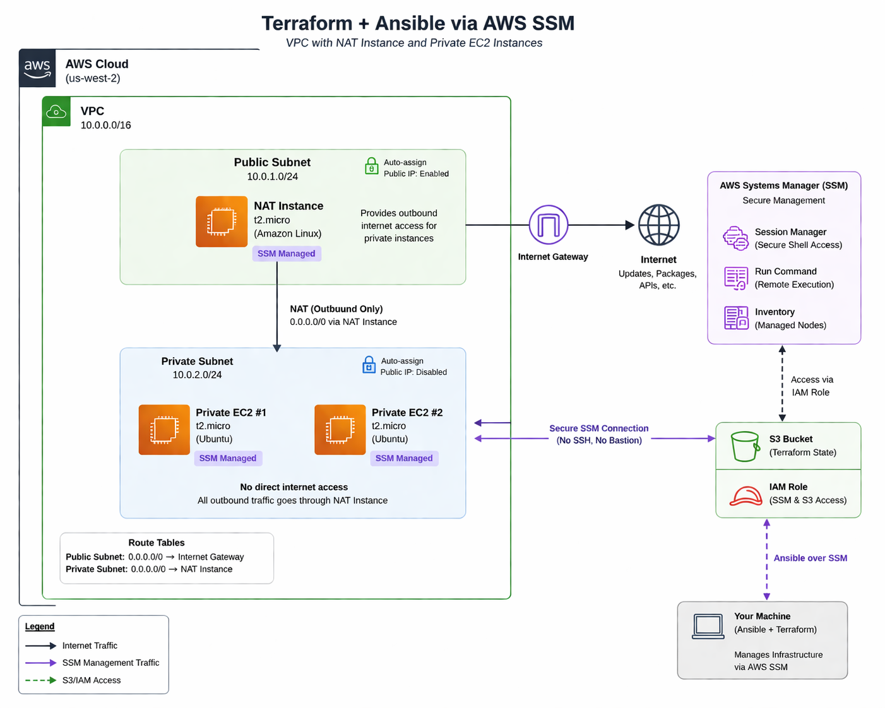

# Terraform + Ansible via AWS SSM
### VPC with NAT Instance and Private EC2 Instances
 
A fully automated AWS environment built with Terraform and configured with Ansible over AWS Systems Manager (SSM) — **no open ports, no SSH keys, no bastion host**.
 
This project provisions a custom VPC with public/private subnets, a **Debian 13** NAT instance bootstrapped entirely via `user_data`, and uses SSM Session Manager as the sole access method for all EC2 instances. Ansible connects through SSM using a dynamic inventory (`aws_ec2` plugin), and secrets are managed via Ansible Vault.

## Architectural Layout

## Cost Considerations

While a NAT Gateway would be the preferred solution in a production or enterprise environment, it was intentionally avoided in this lab due to cost considerations. Similarly, replacing the NAT instance with the required SSM interface endpoints (ssm, ssmmessages, ec2messages) was evaluated, but deemed less cost-effective for this use case. Given the ephemeral nature of the environment—frequent provisioning, updating, and teardown—the NAT instance approach provides the most economical balance, as it minimizes both infrastructure and data processing costs.